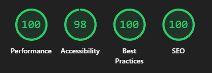

I will be making a web portfolio using bootstrap with scss. I can use this for job searching. The home page tells something about me briefly.

The skills page first gives a basic overview of my skills. The bars are animated on load to show how good I’m with the skill is question.

The projects page shows a list of my projects by title. Pressing the title opens the project on the page which tells more about the project.

All of the features will be made with responsitivity, intuitivity and usage in mind.

Nothing is final and everything will most likely be more polished. I had troubles with making figma interactive.

I tested the website's performance using Google Lighthouse. From the first analysis I noticed that the performance was quite bad and that was because I was using the original over 2440x3253 image for a small image of me. After realizing this I resized the image to be what I needed and also converted it to webp which gave me performance score of 100. Now the only score that was partially low was SEO due to missing meta description. After doing the test I promptly added the meta description.

After this is I did mobile tests with the same tool and got performance score of 91. I managed to increase this to 95 by deferring the script and compiling the scss files compressed.